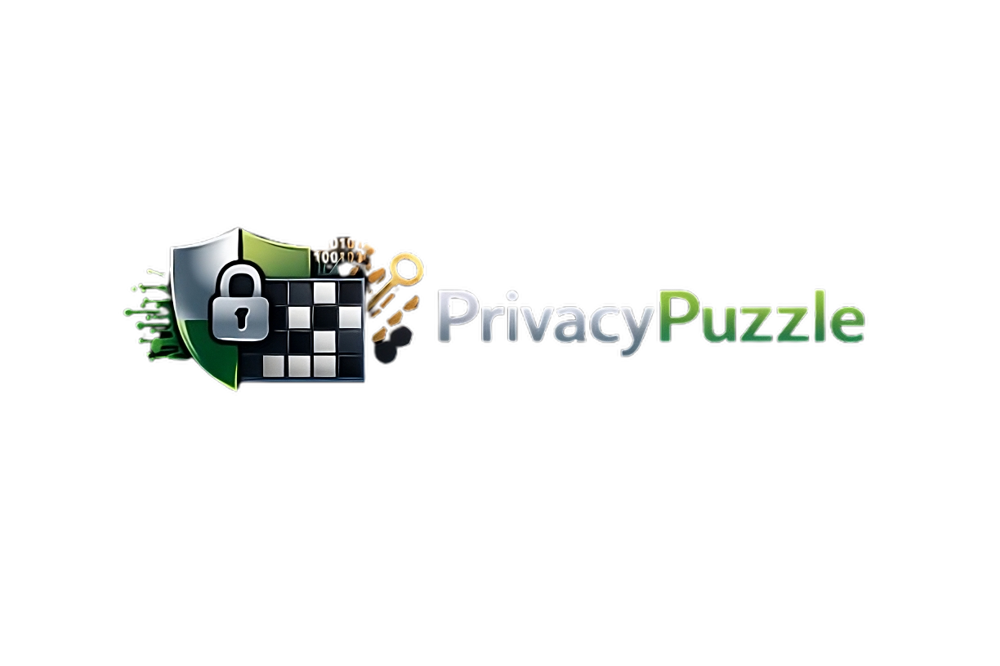
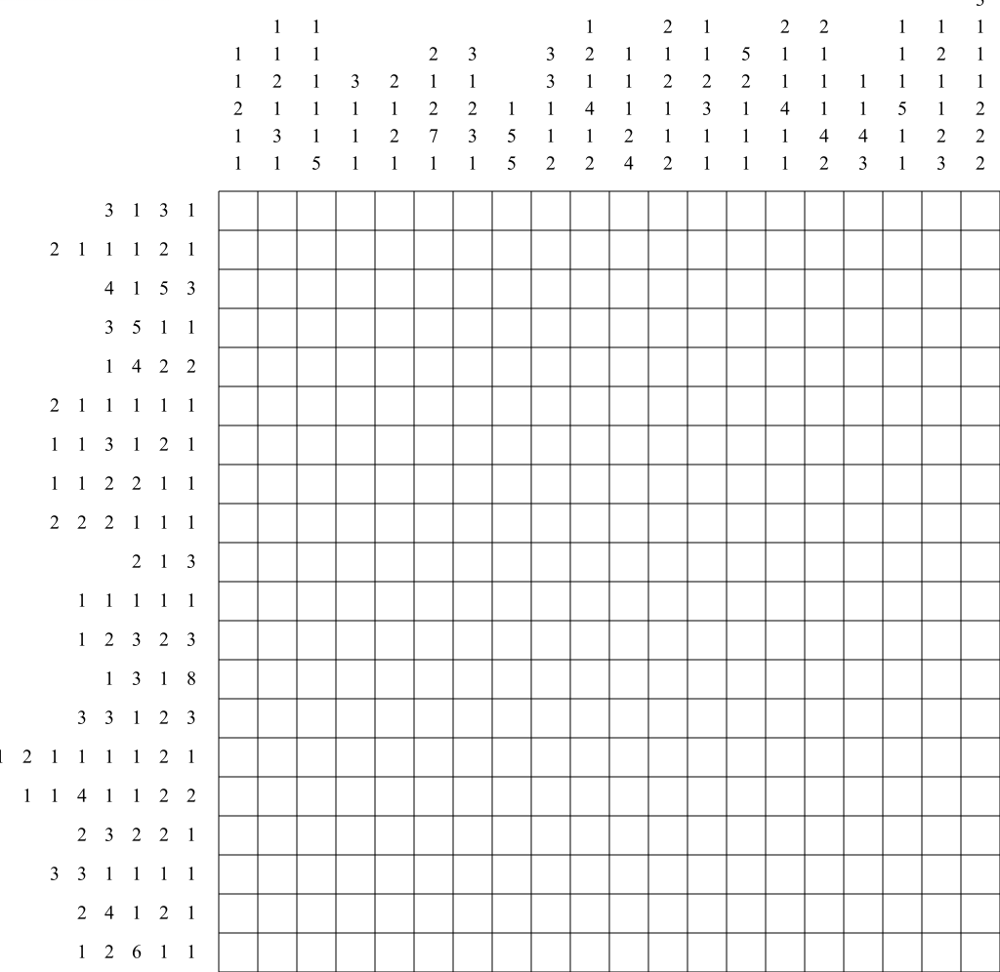

# PrivacyPuzzle
## Secure Message Encryption in Procedural Digital Puzzles

**PrivacyPuzzle** is a Node.js–based application that combines advanced **cryptography** and **steganography** with **procedural puzzle generation** to securely embed confidential messages within digital **nonograms**.

The project emphasizes **[ethical privacy practices](https://vdait.com/blogs-1/f/ethical-considerations-in-software-development-and-data-privacy)** and aligns with internationally recognized standards, including:

- **NIST SP 800-38D** — AES-256-GCM authenticated encryption  
- **RFC 2898** — PBKDF2 key derivation  
- **ISO/IEC 27001** — Information Security Management  
- **GDPR Article 5** — Data minimization and accountability  

### Key Design Principles

- Modular architecture designed for reusability and long-term scalability  
- Robust error handling with secure-by-default configuration  
- Strong educational focus to promote responsible and ethical cryptographic usage  

### Use Cases

PrivacyPuzzle is designed as a **professional demonstration of applied cryptography**, making it well suited for:

- Cybersecurity and software engineering portfolios  
- Educational workshops and technical training environments  
- Research, experimentation, and proof-of-concept work in secure steganographic systems  

---

*Because hiding secrets inside puzzles is more elegant than shouting them into the void.*

## Installation

Follow the steps below to set up **PrivacyPuzzle** in a local development environment.

### Prerequisites
- **Node.js ≥ 18.0.0** (as specified in the `engines` field of `package.json`)
- **npm** (bundled with Node.js)

### Setup

1. **Clone the repository** and navigate into the project directory:
```bash
git clone https://github.com/0xlayout/privacypuzzle.git
cd privacypuzzle
```

2. **Install project dependencies**:
```bash
npm install
```

3. **(Optional) Enable global CLI usage**

To use PrivacyPuzzle as a system-wide CLI command, add the following entry to `package.json`:

```json
"bin": {
  "privacypuzzle": "./index.js"
}
```

Then link the package locally:
```bash
npm link
```

All dependencies are locked via `package-lock.json` to ensure reproducible builds across environments.

## CLI Usage

PrivacyPuzzle is operated through a command-line interface built with **Commander.js**.

```bash
privacypuzzle <command> [options]
```

Each command is designed with explicit responsibilities, secure defaults, and clearly defined option boundaries.

### Command Overview

| Command   | Description                                                                                                                 | Required Options                   | Optional Options                                                                             |
| --------- | --------------------------------------------------------------------------------------------------------------------------- | ---------------------------------- | -------------------------------------------------------------------------------------------- |
| `hide`    | Generates a nonogram, encrypts the message using **AES-256-GCM**, and embeds it via **LSB steganography** into a PNG image. | `-m <message>`, `-p <password>`    | `-s <size>` (default: 15), `-c <cell-size>` (default: 40), `-o <output>` (default: `puzzle`) |
| `reveal`  | Extracts hidden data from a PNG image and decrypts it using the provided password.                                          | `-i <input-path>`, `-p <password>` | —                                                                                            |
| `educate` | Displays structured educational content covering privacy principles, cryptography concepts, and risk awareness.           | —                                  | —                                                                                            |

---

## `hide` Command

The `hide` command executes the complete PrivacyPuzzle pipeline. It creates a procedural nonogram (binary grid with row and column hints), renders it as a PNG image, encrypts the message, and embeds the resulting ciphertext into the image’s least significant bits.

The embedding strategy applies controlled bit diffusion to reduce susceptibility to basic statistical detection techniques.

### Step-by-Step Execution
1. Generate a random nonogram grid and calculate row and column hints.  
2. Render the puzzle as a high-resolution PNG using **Sharp**.  
3. Derive a cryptographic key via **PBKDF2** and encrypt the message using **AES-256-GCM**.  
4. Embed the encrypted payload into the PNG pixel data.  
5. **Output**: A PNG file written to `./output/secure-puzzle.png`, with progress and success messages logged to the console.

### Practical Example
```bash
privacypuzzle hide -m "Confidential meeting on December 27, 2025" -p "StrongPassphrase2025!" -s 20 -o secure-puzzle
```

<table>
  <tr>
    <td align="center">
      
    </td>
  </tr>
</table>

---

## `reveal` Command

The `reveal` command executes the recovery pipeline of PrivacyPuzzle. It loads a PNG image containing hidden data (previously generated by the `hide` command), extracts the embedded ciphertext from the least significant bits of the pixels, and decrypts it using AES-256-GCM with the provided password, verifying the authentication tag for integrity.

### Step-by-Step Execution
1. Read the PNG image buffer from the specified file path.
2. Extract the payload by reading the LSB of each channel (RGB/A), starting with a 4-byte length header for blind recovery.
3. Decrypt the extracted data using the user-provided password, deriving the key via PBKDF2 and validating the GCM authentication tag.
4. On success, output the original plaintext message; on failure (e.g., incorrect password or corrupted data), throw a descriptive error.

### Practical Example
```bash
privacypuzzle reveal -i output/secure-puzzle.png -p "StrongPassphrase2025!"
```

**Output**: Progress logs followed by the decrypted message, e.g., "Confidential meeting on December 27, 2025".

---

## `educate` Command

The `educate` command outputs pedagogical content intended to improve user awareness of security concepts, risks, and best practices.

### Practical Example
```bash
privacypuzzle educate
```

**Output**: A multi-section guide covering AES-256-GCM, steganography limitations, password hygiene, and modern privacy principles.

---

## Modules and Code Examples

The codebase follows a modular architecture, with each file in `./lib/` encapsulating a specific responsibility. Modules are written using modern ES6+ syntax and documented with **JSDoc**, enabling testing, extension, and security review.

| Module               | Purpose                                                               | Key Features                                                                  |
| -------------------- | --------------------------------------------------------------------- | ----------------------------------------------------------------------------- |
| `encryption.js`      | Handles AES-256-GCM encryption and decryption.                         | PBKDF2 (100,000 iterations), random salt and IV, authentication tag handling. |
| `steganography.js`   | Implements LSB steganography for PNG images.                           | Multi-bit embedding (up to 4 bits/pixel), capacity checks, payload headers.   |
| `puzzleGenerator.js` | Procedural nonogram generation and rendering.                         | Random binary grid (~45% fill), hint calculation, SVG-to-PNG conversion.      |
| `education.js`       | Provides structured educational content.                              | Sections aligned with NIST and ISO security guidance.                         |

### `encryption.js` Example
```js
const { encrypt, decrypt } = require('./lib/encryption');

const encryptedData = encrypt('Sensitive message', 'SecurePassword123');
const decryptedMessage = decrypt(encryptedData, 'SecurePassword123');
// Returns: 'Sensitive message'
```

This module derives a 256-bit key using PBKDF2, generates unique salt and IV values, and enforces integrity via authenticated encryption.

### `steganography.js` Example
```js
const fs = require('fs');
const { hideData, extractData } = require('./lib/steganography');

const imageBuffer = fs.readFileSync('base.png');
const hiddenImage = await hideData(imageBuffer, Buffer.from('Hidden text'));
fs.writeFileSync('stego.png', hiddenImage);

const extracted = await extractData('stego.png');
// Returns: Buffer.from('Hidden text')
```

This example demonstrates embedding across RGB(A) channels with explicit error handling for insufficient image capacity.

### `puzzleGenerator.js` Example
```js
const fs = require('fs');
const { generateNonogram, renderNonogramPuzzle } = require('./lib/puzzleGenerator');

const { rowHints, colHints } = generateNonogram(15, 15, 0.45);
const puzzleBuffer = await renderNonogramPuzzle(rowHints, colHints, 40);

fs.writeFileSync('puzzle.png', puzzleBuffer);
```

This generates a solvable nonogram and renders it as a scalable PNG suitable for steganographic embedding.

### `education.js` Example
```js
const { getFullEducationalContent } = require('./lib/education');

console.log(getFullEducationalContent());
// Outputs comprehensive privacy and security guidance
```

---

## Dependencies Used

Dependencies are selected for performance, security, and minimal attack surface, as defined in `package.json`.

### Dependency Summary

| Dependency             | Version | Purpose in PrivacyPuzzle                                             | Official Documentation                                       | Example Usage                                                                 |
| ---------------------- | ------- | -------------------------------------------------------------------- | ------------------------------------------------------------ | ----------------------------------------------------------------------------- |
| `sharp`                | 0.33.5  | High-performance image rendering and manipulation.                   | Sharp API                                                    | `sharp(svgBuffer).png().toBuffer();`                                          |
| `commander`            | 11.1.0  | CLI argument parsing and command structuring.                         | Commander.js                                                 | `program.command('hide').action(async (opts) => {...});`                      |
| `jimp`                 | 0.22.12 | Fallback image processing engine.                                     | Jimp                                                         | `Jimp.read(buffer).getBufferAsync(Jimp.MIME_PNG);`                            |
| `crypto` (Node native) | N/A     | Native AES-256-GCM and PBKDF2 cryptographic primitives.               | Node.js Crypto                                               | `crypto.createCipheriv('aes-256-gcm', key, iv);`                              |
| `jest` (dev)           | 29.7.0  | Unit and integration testing framework.                               | Jest                                                         | `expect(decrypt(encrypt(msg, pw), pw)).toBe(msg);`                            |

Using Node.js native cryptography reduces dependency risk and aligns with established industry best practices.

## Testing

Run the complete test suite:
```bash
npm test
```

This executes 16 advanced tests covering cryptographic correctness, steganographic resilience, and end-to-end workflows.

## Contributions

Contributions are welcome. Fork the repository, create a feature branch, and submit a pull request following the [Contributor Covenant](https://www.contributor-covenant.org/).

Priority areas include additional puzzle types, extended educational content, and optional web-based interfaces.

## License

Released under the **MIT License**.  
© 2025 0xlayout — Dedicated to advancing ethical privacy tooling.
